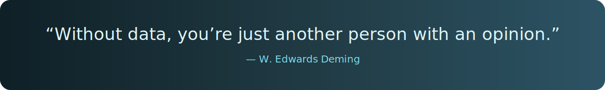

# 👋 About Me

Hi there! I'm Noorul Hasiba, a passionate **Computer Science & Data Science student**.  
I love exploring data, uncovering patterns, building predictive models, and turning insights into **practical, real-world solutions**.  
I enjoy working on **web applications, deep learning projects, and machine learning pipelines**, continuously learning new technologies, solving challenging problems improving my skills. Let's connect and collaborate

---
## 🌐 Socials

---
## 💻 Tech Stack
 
### Programming & Web

### Data Science & AI

---

## ✨ Featured Projects
- **Smart Form Filling System using AI & LLM** (Web App + LLM API) (Ongoing)
- **Handwriting Writer Identification** (Deep Learning + CNN + Streamlit) (Ongoing)
- **Aircraft Tech Log Application** (React + TypeScript + Tailwind)
- **Breast Cancer Classification System** (ML + Healthcare AI)
- **SafeZone – Real-Time Emergency Assistance System** (Web + Location)
- **WriteID – Handwriting Writer Recognition** (Deep Learning + CNN + OpenCV)
---

